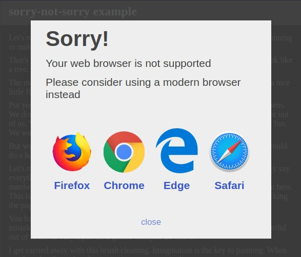

# sorry-not-sorry 💬
## prompt legacy browsers to upgrade



`sorry-not-sorry` has a simple job

1. call anything that [can't handle arrow functions](https://caniuse.com/#feat=arrow-functions) a 'legacy' browser (ie11)
2. present legacy browsers with the popup which suggests they upgrade

[🗲 live demo](https://chasemoskal.com/sorry-not-sorry/#sorry-force-legacy)

## install and use sorry-not-sorry

insert a [sorry-not-sorry](https://unpkg.com/sorry-not-sorry) script element on your page

```html
<script async defer src="https://unpkg.com/sorry-not-sorry"></script>
```

and that's all 💪

have fun out there  
&nbsp; 👋 Chase
